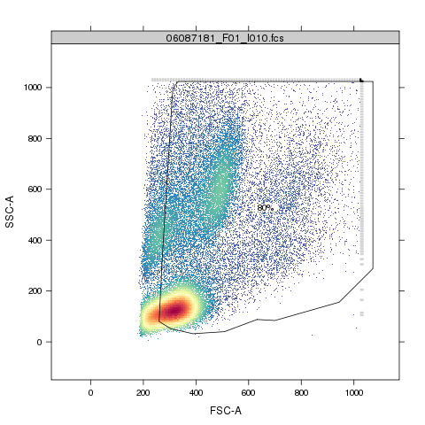

## Background
  The current `flowQ` package does the quality assessment on the ungated FCM data. However, there is a need to
  identify deviant samples by monitoring the consistencies of the underlying statistical properties of different gated cell 
  populations (such as white blood cells, lymphacytes, monocytes etc). The `flowQ` package was also not designed for dealing with
  large datasets. To meet these needs, We developed `QUALIFIER` package using the gating template created in flowJo and performing
  QA checks on different gated populations. It divides the data preprocessing from the actual outlier detection process so that the statistics
  are calcuated all at once and the outlier detection and visualization can be done more efficiently and interactively.
  `ncdfFlow` is used to solve the memory limit issue for large datasets. 


```{r loadPackage-QUALIFIER, echo=FALSE,results='hide', message=FALSE}
library(QUALIFIER)
QUALIFIER:::qa.par.set("idCol","id")
QUALIFIER:::qa.par.get("idCol")
```

## Parsing the QA gating template
`flowjo_to_gatingset` function from `flowWorkspace` package is used to parse the flowJo workspace.
Since we are only interested in the gating strategy (gates defined in the template),`execute` can be set as FALSE  
to skip the actual gating process. `useInternal` is set as TRUE to use internal structure (c++) for faster parsing. 
Please see the documentation of `flowWorkspace` package for more details regarding how to use `flowjo_to_gatingset` function. 
```{r flowjo_to_gatingset, eval=FALSE, echo=TRUE,results='markup'}
ws<-open_flowjo_xml("./data/QA_MFI_RBC_bounary_eventsV3.xml")##should replace with your own xml workspace file path
GT<-flowjo_to_gatingset(ws,execute=FALSE,useInternal=TRUE)
```

## Apply the gating template to the data
Then gating hierarchy `gh_template` containing the actual template gates is extracted
from the result `GatingSet` "`GT`". 
```{r gh_template1, eval=FALSE, echo=TRUE,results='markup'}
gh_template<-GT[[1]]  				
```

The `GatingSet` method here is the contructor that takes a `gatingHierarchy` object as the template and a list of FCS file names (`filenames`) that need the quality assurance.
The result "G" is the `GatingSet` that contains the gated data and some of the cell population statistics that can be viewed by `gh_pop_compare_stats` method.
```{r gh_template2, eval=FALSE, echo=TRUE,results='markup'}
##datapath is the path where FCS files stores
G<-GatingSet(gh_template,filenames,path="./data")
gh_pop_compare_stats(G[[1]])
```
Optionally, `isNcdf` can be set to TRUE to support netCDF storage of large flow datasets when memory resource is limited. 

## Calculating the statistics
After flow data is gated, the statistics of the gated data need to be extracted and saved before the QA checks. 
`db` is an environment that serves as a container storing all the QA data and results.
Firsly, `initDB` function initializes and creates the data structures for QA. 
Then `qaPreprocess` is a convenient wrapper that calls underlining routines (`getQAStats},`saveToDB`)
to calculates/extracts statistics of gated cell populations and save them along with the gating set and the FCS meta data.
`metaFile` is a csv file that contains the extra annoations about each FCS file.It should at least have one column
speficifying FCS file names.

```{r getQAStats, eval=FALSE ,echo=TRUE, results='markup'}
db<-new.env()
initDB(db)
qaPreprocess(db=db,gs=G
			,metaFile="./data/FCS_File_mapping.csv" #should replace with your own FCS meta data file path
			,fcs.colname="FCS_Files"
			,date.colname=c("RecdDt","AnalysisDt")
	)
```
`fcs.colname` and `date.colname` are the arguments to identify the columns in the meta data (the flat table stored as a csv file)
that specifies the FCS filenames and the dates (to be formatted as to "m/d/y"). 
Once the preprocessing steps are finished, the data are ready for quality assessments. 

## Defining qaTasks 
```{r loadData, echo=FALSE, results='hide'}
data("ITNQASTUDY")
```

`read.qaTask` reads external csv spreadsheet that contains the descriptions of each QA task and creates a list of `qaTask` objects. 

```{r read.qaTask, echo=TRUE, results='markup'}
checkListFile<-file.path(system.file("data",package="QUALIFIER"),"qaCheckList.csv.gz")
qaTask.list<-read.qaTask(db,checkListFile=checkListFile)
qaTask.list[1:2]
```
The `qaTask` can also be created individually by the contructor `makeQaTask`.

## Quality assessment and visualiztion 
`qaCheck` and `plot` are the two main methods to perform the quality assessment and visualize the QA results.
They both use the information stored in `qaTask` object 
and the `formula`, which is given either explicitly by the argument or implicitly by the `qaTask` object.
It is generally of the form y ~ x | g1 * g2 * ... , where y is the statistics to be checked in this QA and must be one of the four types:
			 
				"MFI": 
					Median Fluorescence Intensity of the cell population specified by `qaTask`,
			
				"proportion": 
						the percentage of the cell population specified by `qaTask` in the parent population, 
			
				"count": 
						the number of events of the cell population specified by `qaTask`,
			
				"spike": 
						the variance of intensity over time of each channel, which indicates the stability of the fluorescence intensity.

x specifies the variable plotted on x-axis (such as date) in the `plot` method.

g1, g2, ... are the conditioning variables, which divide the data into subgroups and 
apply the outlier detection whitin each individual group or plot the subgroups in different panels.
They may also be omitted, in which case the outlier detection is peformed in the entire dataset.

For example, RBC Lysis efficiency (percentage of WBC population) check is defined by `qaTask` .
```{r qaTask-RBCLysis, results='markup'}
qaTask.list[["RBCLysis"]]
```

According to the formula stored in `qaTask`, it uses the statistical property "proportion" and groups 
the data by "Tube" (or staining panel). "RecdDt" is only for the plotting purpose (specifing the x-axis). Cell population is defined as "WBC\_perct"
```{r qaCheck-RBCLysis, results='markup'}
qaCheck(qaTask.list[["RBCLysis"]]
       ,outlierfunc=list(func = outlier.cutoff
                        ,args =  list(lBound=0.8)
                       )
      )
```

`qaCheck` reads all the necessary information about the gated data from `qaTask` object.
Users only needs to specificy how the outliers are called. This is done by 
providing an outlier detection function `outlierfunc` that takes a numeric vector as input and returns a logical vector as the output.
Here `outlier.cutoff` provided by the package is used and threshold "lBound" is specified ("less than", use uBound for "larger than"). 

After the outliers are called, the results can be plotted by `plot` method.
```{r plot-RBCLysis, results='markup'}
plot(qaTask.list[["RBCLysis"]],xlab="Record Date",ylab="percent")
```

By default all the data are plotted, argument "subset" can be used to visualize a small subset.
 
```{r plot-RBCLysis-subset, results='markup'}
plot(qaTask.list[["RBCLysis"]],subset=Tube=='CD8/CD25/CD4/CD3/CD62L',xlab="Record Date",ylab="percent")
```

`clearCheck` is the method to removes the outlier results detected by the previous `qaCheck` call for the specific qaTask.
```{r clearCheck,results='markup'}
clearCheck(qaTask.list[["RBCLysis"]])
```

With `scatterPlot` flag set as true and  `subset` properly specified plot method can generate scatter plots for the selected FCS files,
```{r plot-RBCLysis-subset2, results='markup',eval=FALSE}
plot(qaTask.list[["RBCLysis"]],subset=name=='06087181_F01_I010.fcs',scatterPlot=TRUE)
```
			

x term in the formula is normally ignored in `qaCheck`. However, when "plotType" of the 
`qaTask` is "bwplot", it is used as the conditioning variable that divides the data into subgroups,
 within which the `outlierfunc` is applied.   
```{r qaTask-MNC,  results='markup'}
qaTask.list[["MNC"]]
```

This qaTask detects the significant variance of MNC cell population percentage among aliquots, which have the same "coresampleid".
Plot type of this object tells the method to group data by "coresampleid".   
```{r qaCheck-MNC,  results='markup'}
qaCheck(qaTask.list[["MNC"]],z.cutoff=1.5)
```

Interquartile Range based outlier detection function is used to detect outliers

```{r plot-MNC, results='markup'}
plot(qaTask.list[["MNC"]],proportion~factor(coresampleid),xlab="Sample ID",ylab="percent",scales=list(x=list(rot=45)))
```

The red circles in the boxplot indicate the possible outlier samples and the box of red color indicates the entire sample group
has significant variance and is marked as the group outlier. By default `qaCheck` uses normal-distribution-based outlier function to detect group outliers.  
User-defined function can also supplied through `gOutlierfunc` argument.Again the function should take a numeric vector as input and returns a logical vector as the output.
The formula supplied here in the plot method overwrites the one stored in the qaTask object, thus change the way of viewing the data.

With `scatterPlot` and `subset` arguments, scatter plots can be generated for the selected FCS files or sample groups,
```{r plot-MNC-scatter, results='markup',eval=FALSE}

plot(qaTask.list[["MNC"]]
		,scatterPlot=TRUE
		,subset=coresampleid==11730)
```

	
		
We can also apply simple aggregation to the statisics through the formula.
```{r qaTask-BoundaryEvents, results='markup'}
qaTask.list[["BoundaryEvents"]]
```

Here the default formula only extracts the "proportion" from each individual channel.
In order to check the total percentage of boundary events of all channels for each fcs file,
we can write a new formula by applying aggregation function "sum" to "proportion" and group the data
by fcs file ("name" in this case).

```{r qaCheck-BoundaryEvents,  results='markup'}
qaCheck(qaTask.list[["BoundaryEvents"]]
        ,sum(proportion) ~ RecdDt | name
        ,outlierfunc=list(func = outlier.cutoff
                          ,args =list(uBound=0.0003)
                          )
        )
```

And we still can visualize the results chanel by chanel.
```{r plot-BoundaryEvents, results='markup'}
plot(qaTask.list[["BoundaryEvents"]],proportion ~ RecdDt | channel,xlab="Record Date",ylab="percent")
```

 
Another three examples:
QA check of Fluorescence stability overtime using t-distribution based outlier detection function.     
```{r qaCheck-MFIOverTime, results='markup'}
qaCheck(qaTask.list[["MFIOverTime"]]
		,rFunc= list (func = rlm
		              ,args = list(z.cutoff=3)
                  )
		)

plot(qaTask.list[["MFIOverTime"]]
		,y=MFI~RecdDt|stain
		,subset=channel%in%c('FITC-A')
		,rFunc=rlm
		,scales=list(y=c(relation="free"))
		,xlab="Record Date"
	)
```

Note that the robust linear regression is applied in each group in order to capture the significant MFI change (highlighted in red color,if pvalues<0.05) over time.
The individual outliers within each group are detected based on the residue.
All the lattice options (like `scales` here in this example) can be passed to control the appearance of trellis plot,see the documentation of `lattice` for more details.

```{r plot-spike, results='markup'}
qaCheck(qaTask.list[["spike"]]
			,outlierfunc = list (func = outlier.t
                                ,args = list(alpha=0.00001)
                                ) 
                
			)

plot(qaTask.list[["spike"]],y=spike~RecdDt|channel
		,subset=Tube=='CD8/CD25/CD4/CD3/CD62L'&channel%in%c('FITC-A')
		,xlab="Record Date"
	)

```

When monitoring the total number of events for each tube, a pre-determined events number can be provided as the threshold to the qaCheck method.
```{r tubesEvents1, results='hide',echo=FALSE}
tubesEvents <- read.csv(file.path(system.file("data",package="QUALIFIER"),"tubesevents.csv.gz"),row.names=1)
tubesEvents <- QUALIFIER:::.TubeNameMapping(db,tubesEvents=tubesEvents[,3,drop=F])
```
`tubesEvents` pass to the argument of `qaCheck` could be a one-column data frame or a named list/vector. 
Threshold values are stored in the column or list/vecor and conditioning values stored in rownames or names of the list/vector.
```{r tubesEvents2, results='markup'}
tubesEvents
```

```{r plot-NumberOfEvents, results='markup'}
qaCheck(qaTask.list[["NumberOfEvents"]]
		,formula=count ~ RecdDt | Tube
		,outlierfunc = list(func = outlier.cutoff
		                    ,args = list(lBound = 0.8 * tubesEvents)
                        )
		  )
plot(qaTask.list[["NumberOfEvents"]]
		,subset=Tube=='CD8/CD25/CD4/CD3/CD62L'
		,xlab="Record Date"
		,ylab="Cell counts"
	)
```


```{r plot-RedundantStain, results='markup'}
qaCheck(qaTask.list[["RedundantStain"]]
        ,gOutlierfunc = list(func = outlier.norm
                            , args =list(z.cutoff = 1)
                            )
         )
plot(qaTask.list[["RedundantStain"]]
		,y=proportion~factor(coresampleid)|channel:stain
		,subset=stain%in%c('CD8')
		,scales=list(x=list(cex=0.5,rot=45))
		,xlab="Sample ID"
		,ylab="percent"
	)
```

## Creating quality assessment report
Besides the interactive visualization provided by `plot` method,we also provide one routine to generate  
all plots in one report.This function reads the QA results calculated by `qaCheck` and the meta information of each QA task provided in spreadsheet qaCheckList and 
generate the summary tables and svg plots. Svg plots provide tooltips containing the detail information about each sample as and 
hyperlinks of densityplot for each individual FCS file.  

```{r qa.report1,eval=FALSE, echo=TRUE, results='markup'}
qaReport(qaTask.list
		,outDir="~/temp"
		,plotAll=FALSE
		,subset=as.POSIXlt(RecdDt)$year==(2007-1900)
		)

```

`plotAll` is the argument to control the plotting of the individual scatter plot for each FCS file. If TRUE, scatter plots for all the FCS files are generated. 
If FALSE, only the FCS files marked as outliers will be plotted. When it is set to "none", no scatter plot will be generated, which is helpful to provide a quick preview of the html report.
`subset` is the filter to only generate the report on a subset of flow data.

Note that if there is need to adjust the QA plot for each indivdiual qaTask in the report, the arguments must be stored in qaTask before qaReport method is called.
If there is no outlier is detected, the qaTask is not plotted by default. In order to change this setting, `htmlReport` can be set as TRUE to plot the qaTask regardlessly.      
This is particually useful for the task that tracks the longitudinal trend instead of the individual outliers.
Besides the lattice arguments that can be configured by `qpar` (for the summary xyplot and bwplot) and `scatterPar` (for the individual FCS xyplot).
`xlog`,`ylog` flag can be set for scatter plot to transform the flow data to log scale for the proper display of the stained channels.
```{r qa.report2,eval=FALSE, echo=TRUE, results='markup'}
htmlReport(qaTask.list[["MFIOverTime"]])<-TRUE
rFunc(qaTask.list[["MFIOverTime"]])<-rlm
scatterPar(qaTask.list[["MFIOverTime"]])<-list(xlog=TRUE)
scatterPar(qaTask.list[["BoundaryEvents"]])<-list(xlog=TRUE)
scatterPar(qaTask.list[["RedundantStain"]])<-list(xlog=TRUE)
qpar(qaTask.list[["RedundantStain"]])<-list(scales=list(x=list(relation="free")))
```


## Conclusion
By the formula-based `qaCheck` and `plot` methods, different QA tasks 
can be defined and performed in a generic way.
And `plot` only reads the outlier detection results pre-calculated by `qaCheck`,
which reduces the cost of interactive visualization.

Two kinds of lattice plots are currently supported:xyplot and bwplot(boxplot), depending on the `plotType` in `qaTask` object.
When the output path is provided by `dest`, the svg plot is generated. 
In svg plot, each dot or box (or only the one marked as outliers) is annotated by the tooltip 
or hyperlink, which further points to the individual density plot of the gated population.


